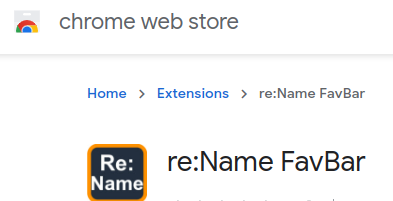
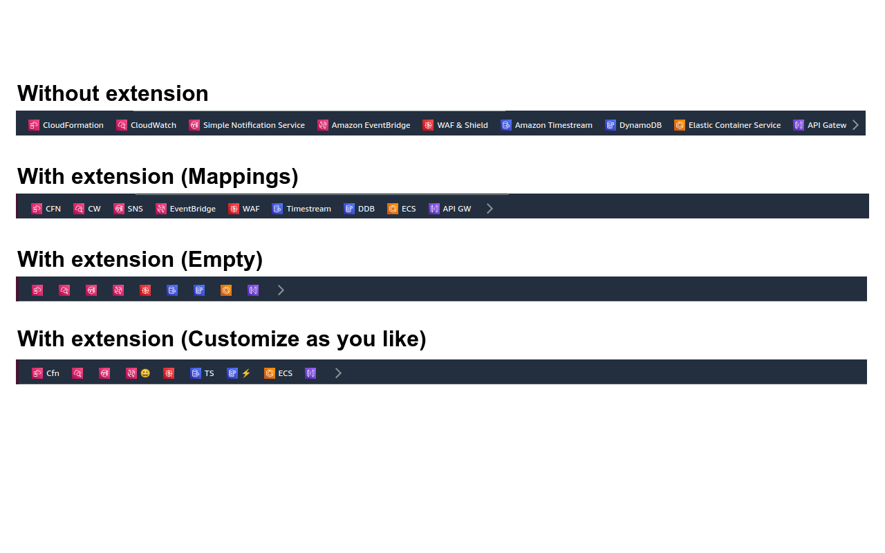
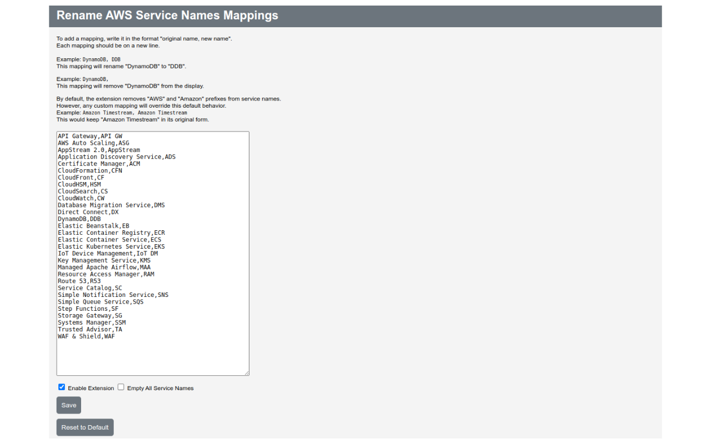

# re:Name FavBar

This Chrome extension simplifies your AWS console experience by renaming the names of AWS service icons. By automatically modifying the text in the DOM, the extension replaces the long service names with more concise abbreviations.

## Released version

You can also find re:Name FavBar on [Chrome Web Store](https://chrome.google.com/webstore/detail/rename-favbar/djibddceopnloddkfmgekaejflcnadli).

## Example of how the extension works

## How to Install the Chrome Extension in Developer Mode

1. Download the extension folder to your computer.
2. Open Google Chrome and navigate to `chrome://extensions/`.
3. Enable **Developer mode** by toggling the switch in the top right corner.
4. Click on the **Load unpacked** button.
5. Browse to the downloaded extension folder, select it, and click **Open**.
6. The extension will now be installed in Developer mode.

For more information on using Chrome extensions in Developer mode, you can visit the [Google Chrome Enterprise Help page](https://support.google.com/chrome/a/answer/2714278?hl=en).

## Settings

Options page:

Use the Options page to set custom mappings for service name abbreviations.

- Default mappings are provided for some services. To add a custom mapping, enter it in the format "original name, new name", with each mapping on a separate line.
- By default, the extension removes "AWS" and "Amazon" prefixes from service names. However, any custom mapping will override this default behavior.

### Custom Mapping Examples

Here are some examples of how to use custom mappings:

| Mapping | Description|
|---|---|
|`DynamoDB, DDB`|Rename "DynamoDB" to "DDB"|
|`DynamoDB,`|Remove "DynamoDB" from the display|
|`Amazon Timestream, Amazon Timestream`|Keep "Amazon Timestream" in its original form|

### Toggle Options

There are also two toggle buttons that provide further customization.

| Toggle | Default |Description|
|---|---|---|
|`Enable Extension`|On|Extension will active and apply the mappings to the service names|
|`Empty All Service Names`|Off|All service names will be removed from display, regardless of the mappings specified|

### Note: Display Update Delay

When you open an AWS Console page, you may initially see the original AWS service names. This is because the extension needs to read the page's Document Object Model (DOM) and then rewrite the navigation bar sections to apply the renamed service names. This operation takes a small amount of time.
## Contributing

Contributions to this project are warmly welcomed! Please feel free to open an issue or submit a pull request.
