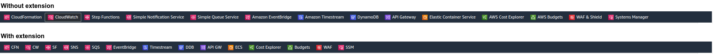

# re:Name FavBar
This Chrome extension simplifies your AWS console experience by renaming the names of AWS service icons. By automatically modifying the text in the DOM, the extension replaces the long service names with more concise abbreviations.

## Example of how the extension works

Image of with and without extension:

## How to Install the Chrome Extension in Developer Mode

1. Download the extension folder to your computer.
2. Open Google Chrome and navigate to `chrome://extensions/`.
3. Enable **Developer mode** by toggling the switch in the top right corner.
4. Click on the **Load unpacked** button.
5. Browse to the downloaded extension folder, select it, and click **Open**.
6. The extension will now be installed in Developer mode.

For more information on using Chrome extensions in Developer mode, you can visit the [Google Chrome Enterprise Help page](https://support.google.com/chrome/a/answer/2714278?hl=en).

## Settings

Use the Options page to set custom mappings for service name abbreviations.

Default mappings are provided for some services.

To add a custom mapping, enter it in the format "original name, new name", with each mapping on a separate line.

Example: `DynamoDB, DDB`
This mapping will rename "DynamoDB" to "DDB".

Example: `DynamoDB,`
This mapping will remove "DynamoDB" from the display.

By default, the extension removes "AWS" and "Amazon" prefixes from service names.
However, any custom mapping will override this default behavior.

Example: `Amazon Timestream, Amazon Timestream`
This would keep "Amazon Timestream" in its original form.

## Contributing

Contributions to this project are warmly welcomed! Please feel free to open an issue or submit a pull request.
